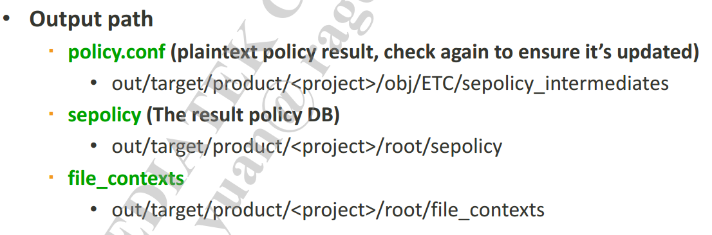
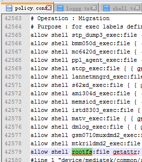

# Android N user版本不能使用mtk logger

[avc log](./loggg.txt)

```
type=1400 audit(0.0:19932): avc: denied { getattr } for path="/verity_key" dev="rootfs" ino=1060 scontext=u:r:shell:s0 tcontext=u:object_r:rootfs:s0 tclass=file permissive=0
```

## 问题分析
- 从`log`来看,是`shell`进程在对`rootfs`的设备进行`file`的`getattr`操作时`denied`

## 解决问题
- 由于`Android N`在`Selinux`有改动,将te文件从`external/sepolicy`搬到了`system/sepolicy`中
- `mtk`在定制`Selinux`的时候也在`device/mediatek/common/sepolicy`建立了三个文件夹
- 暂时不清楚三个文件夹的作用,但并不妨碍我们解决问题
- 通过`mmm system/sepolicy`命令可以生成`policy.conf`来确定te语句编译进系统中
- 我在`mtk`的`full`夹子的`shell.te`将需要的权限声明
	> ##### #add by huguojin en enable mtklogger in user mode
	> ##### allow shell rootfs:file getattr;

- 全编后的out目录 
- `policy.conf`显示已经将刚刚添加的te语句编译进系统里 